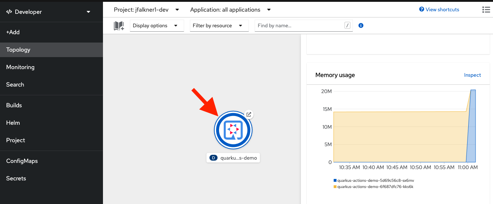
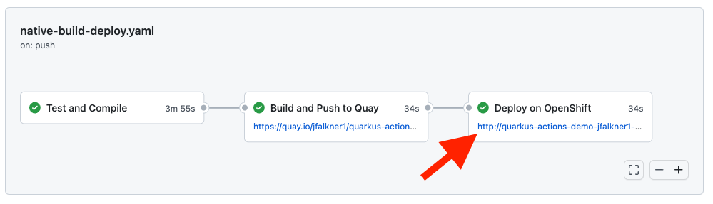

# quarkus-actions-demo Project

This project demonstrates an example GitHub workflow for building native Quarkus applications, containerizing using [Buildah](https://buildah.io), pushing to [Quay](https://quay.io) and then deploying to [OpenShift](https://openshift.com). This can be modified to fit your CI/CD needs.

This project uses Quarkus, the Supersonic Subatomic Java Framework, and builds a native executable with [Mandrel](https://github.com/graalvm/mandrel) for stunningly fast performance and tiny footprint.

If you want to learn more about Quarkus, please visit its website: https://quarkus.io/ .

# Prereqs

To run this demo you'll need:

- An OpenShift 4.x server running somewhere, publicly accessible (You can get a free one through the [Red Hat Developer Sandbox](https://developers.redhat.com/developer-sandbox) )
- Your OpenShift login credentials (username and token)
- A container registry that is publicly accessible and writable by you. For example, you can create a new registry on [Quay](https://quay.io).
- Your container registry credentials (username and token)

# Running the demo

You'll need to first fork this repo, then setup secrets, and finally modify the GitHub Actions workflow file. Here's how:

## Secrets

You'll need to create the following [GitHub Secrets](https://docs.github.com/en/actions/security-guides/encrypted-secrets) on your repository:

- `OPENSHIFT_SERVER` set to the URL of your OpenShift server's Kubernetes API endpoint (including port number)
- `OPENSHIFT_TOKEN` your login token (you can get this through the OpenShift console by clicking on your username and selecting "Copy Login Command")
- `REGISTRY_PASSWORD` set to your container registry's password you'd normally use when logging into it
  
## GitHub Workflow

In your fork, update the `.github/workflows/native-build-deploy.yaml` as follows:

- Change `REGISTRY_USER` to your container registry username
- Change `IMAGE_REGISTRY` to your container registry (e.g. `quay.io`)
- Change `APP_NAME` to your container repository name on your container registry
- Change `TEST_NAMESPACE` to the name of the OpenShift namespace in which the app will be deployed

Push those changes to your repository and it should trigger the workflow to build and deploy the app to OpenShift!

## Access app

The URL to your running app on OpenShift is shown on the GitHub Actions summary:

Alternatively, you'll also see the running app on the OpenShift Web Console:

